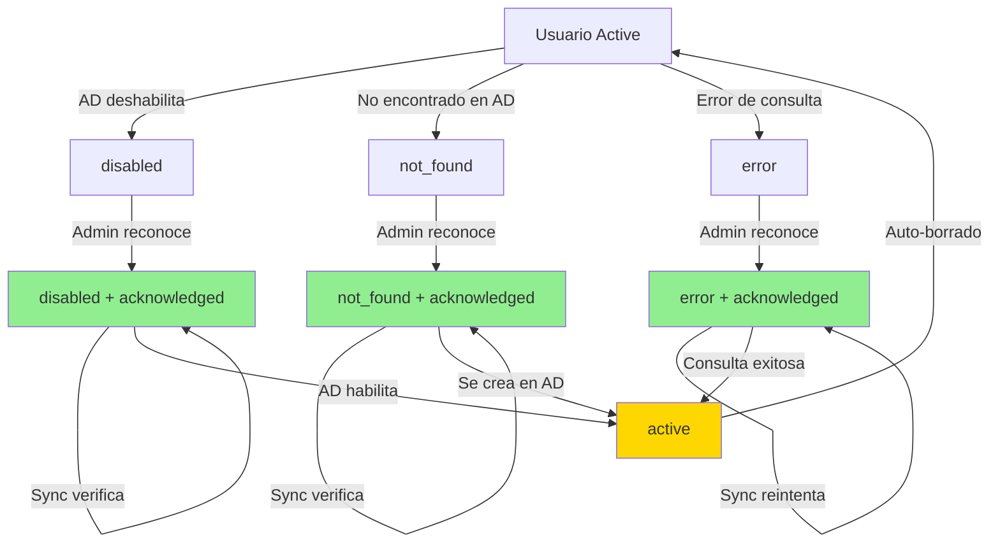

# Persistencia de Reconocimientos de Problemas AD

## Problema Resuelto

### Situación Anterior
Los usuarios marcados como "reconocidos" en el panel de problemas AD (`/admin/users/ad-status`) **se perdían automáticamente** cada vez que se ejecutaba una sincronización con Active Directory, incluso si el problema persistía.

**Ejemplo:**
1. Admin encuentra usuario con estado `disabled` en AD
2. Admin marca el usuario como "reconocido" (ad_acknowledged = true)
3. Scheduler ejecuta sync cada 5 minutos
4. Usuario sigue `disabled` en AD → Sync ejecuta `mark_ad_disabled()`
5. ❌ **Se pierde el reconocimiento** (ad_acknowledged vuelve a false)
6. Usuario vuelve a aparecer en lista de "problemas"

### Frecuencia del Problema
- **Scheduler**: Cada 5-15 minutos (según configuración)
- **Celery workers**: Al procesar cualquier tarea de sync
- **Sync manual**: Cuando admin ejecuta desde interfaz

Un usuario reconocido podía "desaparecer" de la lista de reconocidos en **cuestión de minutos**.

---

## Solución Implementada

### Lógica Nueva: Preservar Reconocimiento Mientras Problema Persiste

Los reconocimientos ahora se comportan de forma inteligente:

| Situación | Estado Anterior | Estado Nuevo | Reconocimiento | Resultado |
|-----------|----------------|--------------|----------------|-----------|
| Usuario `disabled` → Sync encuentra `disabled` | ❌ Se borraba | ✅ Se mantiene | Persiste | ✅ Queda en "reconocidos" |
| Usuario `not_found` → Sync no lo encuentra | ❌ Se borraba | ✅ Se mantiene | Persiste | ✅ Queda en "reconocidos" |
| Usuario `error` → Sync sigue con error | ❌ Se borraba | ✅ Se mantiene | Persiste | ✅ Queda en "reconocidos" |
| Usuario `disabled` → Admin lo habilita en AD | ✅ Se borraba | ✅ Se borra | Se elimina | ✅ Problema resuelto |
| Usuario `not_found` → Se crea en AD | ✅ Se borraba | ✅ Se borra | Se elimina | ✅ Problema resuelto |

### Regla Simple
- **Problema persiste** → Reconocimiento se **mantiene**
- **Problema se resuelve** (usuario vuelve a `active`) → Reconocimiento se **borra automáticamente**

---

## Cambios Técnicos

### Archivo Modificado: `app/models/user.py`

#### 1. `mark_ad_not_found()` (línea 63-69)
```python
def mark_ad_not_found(self):
    """Mark user as not found in AD and set as inactive"""
    self.ad_status = 'not_found'
    self.ad_last_check = datetime.utcnow()
    self.ad_error_count = (self.ad_error_count or 0) + 1
    self.is_active = False
    # Note: Acknowledgment is preserved while problem persists
    # ❌ REMOVIDO: self.unacknowledge_ad_issue()
```

#### 2. `mark_ad_error()` (línea 81-86)
```python
def mark_ad_error(self):
    """Mark user as having AD lookup error"""
    self.ad_status = 'error'
    self.ad_last_check = datetime.utcnow()
    self.ad_error_count = (self.ad_error_count or 0) + 1
    # Note: Acknowledgment is preserved while problem persists
    # ❌ REMOVIDO: self.unacknowledge_ad_issue()
```

#### 3. `mark_ad_disabled()` (línea 88-93)
```python
def mark_ad_disabled(self):
    """Mark user as disabled in AD"""
    self.ad_status = 'disabled'
    self.ad_last_check = datetime.utcnow()
    self.is_active = False
    # Note: Acknowledgment is preserved while problem persists
    # ❌ REMOVIDO: self.unacknowledge_ad_issue()
```

#### 4. `mark_ad_active()` (línea 71-79) - **SIN CAMBIOS**
```python
def mark_ad_active(self):
    """Mark user as active in AD and reactivate if needed"""
    self.ad_status = 'active'
    self.ad_last_check = datetime.utcnow()
    self.ad_error_count = 0
    self.last_sync = datetime.utcnow()
    self.is_active = True
    # Reset acknowledgment when user becomes active (problem resolved)
    self.unacknowledge_ad_issue()  # ✅ SE MANTIENE
```

---

## Casos de Uso

### Caso 1: Usuario Deshabilitado Temporalmente
**Escenario:** Empleado de baja temporal (vacaciones, excedencia)

1. AD marca usuario como `disabled`
2. Sync detecta → Usuario aparece en "Problemas AD"
3. Admin reconoce: "Baja temporal conocida, OK"
4. **Antes:** Cada sync borraba reconocimiento → Admin debía reconocer 288 veces/día (cada 5 min)
5. **Ahora:** Reconocimiento persiste → Usuario queda en "reconocidos" hasta que vuelva activo

### Caso 2: Usuario Eliminado del AD
**Escenario:** Ex-empleado eliminado del AD pero con permisos legacy en sistema

1. AD no encuentra usuario → `not_found`
2. Admin reconoce: "Ex-empleado, permisos en revisión"
3. **Antes:** Reconocimiento se perdía en cada sync
4. **Ahora:** Persiste hasta que se resuelva (eliminar permisos o recrear usuario)

### Caso 3: Problema Temporal de Red/AD
**Escenario:** Error de conectividad con AD

1. Sync falla → Usuario marcado como `error`
2. Admin reconoce: "Problema de red conocido"
3. **Antes:** Se borraba en cada reintento
4. **Ahora:** Persiste hasta que AD responda correctamente

### Caso 4: Usuario Reactivado (Problema Resuelto)
**Escenario:** Usuario deshabilitado vuelve a activarse

1. Usuario `disabled` reconocido
2. Admin habilita cuenta en AD
3. Sync detecta → `mark_ad_active()` ejecutado
4. **Resultado:** Reconocimiento se borra automáticamente (problema resuelto)
5. Usuario sale de panel de problemas

---

## Integración con Sincronizaciones

### Puntos de Sincronización Afectados

#### 1. **Scheduler Service** (`app/services/scheduler_service.py`)
- Método: `_sync_active_permissions()`
- Frecuencia: Cada 5-15 minutos (configurable)
- Acción: Verifica usuarios en permisos activos
- **Comportamiento:** Reconocimientos persisten entre ejecuciones

#### 2. **Celery Workers** (`celery_worker.py`)
- Tareas:
  - `sync_memberships_optimized_task()`
  - `sync_users_from_ad_task()`
- Frecuencia: Bajo demanda / programadas
- **Comportamiento:** Reconocimientos persisten durante procesamiento

#### 3. **Sync Manual** (`app/services/ldap_service.py`)
- Métodos:
  - `sync_users()`
  - `sync_groups()`
- Frecuencia: Cuando admin ejecuta manualmente
- **Comportamiento:** Reconocimientos persisten en sync completo

---

## Flujo de Estados y Reconocimiento



**Leyenda:**
- 🟢 Verde: Estados con reconocimiento persistente
- 🟡 Amarillo: Estado que borra reconocimiento

---

## Acciones del Administrador

### Ver Usuarios Reconocidos
```
URL: /admin/users/ad-status?status=acknowledged
```

Muestra todos los usuarios con:
- `ad_status` IN ('disabled', 'not_found', 'error')
- `ad_acknowledged = True`

### Reconocer un Usuario
1. Ir a `/admin/users/ad-status?status=problematic`
2. Click en "Reconocer" para el usuario problemático
3. Sistema guarda:
   - `ad_acknowledged = True`
   - `ad_acknowledged_at = TIMESTAMP`
   - `ad_acknowledged_by = admin_id`

### Des-reconocer Manualmente (si es necesario)
```python
# Endpoint: /admin/users/<user_id>/unacknowledge
user.unacknowledge_ad_issue()
db.session.commit()
```

**Nota:** Esto es raro, normalmente el reconocimiento se borra automáticamente cuando el problema se resuelve.

---

## Auditoría

Todos los cambios de reconocimiento se registran en `audit_events`:

```sql
-- Ver historial de reconocimientos
SELECT
    ae.created_at,
    u.username as admin,
    ae.action,
    ae.description,
    tu.username as target_user
FROM audit_events ae
JOIN users u ON ae.user_id = u.id
LEFT JOIN users tu ON ae.resource_id = tu.id
WHERE ae.action IN ('acknowledge_user_issue', 'unacknowledge_user_issue')
ORDER BY ae.created_at DESC;
```

---

## Monitoreo

### Verificar Reconocimientos Activos
```bash
# Contar usuarios reconocidos
docker-compose exec db psql -U saruser -d sardb -c "
SELECT
    ad_status,
    COUNT(*) as total_recognized
FROM users
WHERE ad_acknowledged = true
GROUP BY ad_status;
"
```

### Verificar Persistencia Tras Sync
```bash
# Antes del sync
echo "Reconocidos ANTES:"
docker-compose exec db psql -U saruser -d sardb -c "
SELECT username, ad_status, ad_acknowledged
FROM users
WHERE ad_acknowledged = true;
"

# Ejecutar sync manual
curl -X POST http://localhost:8081/admin/sync-users \
  -H "Cookie: session=..." \
  -H "X-CSRFToken: ..."

# Después del sync
echo "Reconocidos DESPUÉS:"
docker-compose exec db psql -U saruser -d sardb -c "
SELECT username, ad_status, ad_acknowledged
FROM users
WHERE ad_acknowledged = true;
"
```

**Resultado esperado:** Los contadores deben ser iguales (reconocimientos persisten)

---

## Testing

### Test 1: Reconocimiento Persiste con Estado Igual
```python
def test_acknowledgment_persists_disabled():
    user = User.query.first()
    user.mark_ad_disabled()
    user.acknowledge_ad_issue(admin_user)
    db.session.commit()

    # Nueva verificación con mismo estado
    user.mark_ad_disabled()
    db.session.commit()

    assert user.ad_acknowledged == True  # ✅ Debe persistir
```

### Test 2: Reconocimiento Se Borra al Resolver
```python
def test_acknowledgment_cleared_on_active():
    user = User.query.first()
    user.mark_ad_disabled()
    user.acknowledge_ad_issue(admin_user)
    db.session.commit()

    # Usuario vuelve a activo
    user.mark_ad_active()
    db.session.commit()

    assert user.ad_acknowledged == False  # ✅ Debe borrarse
    assert user.ad_status == 'active'
```

---

## Migración (No Requerida)

**Este cambio NO requiere migración de base de datos:**
- ✅ Sin cambios en esquema
- ✅ Sin nuevas columnas
- ✅ Sin modificación de tipos de datos
- ✅ Solo cambios en lógica de aplicación

Los reconocimientos existentes se mantienen automáticamente.

---

## Beneficios

1. ✅ **Reduce carga de trabajo del admin**: No necesita reconocer el mismo problema 288 veces/día
2. ✅ **Información persistente**: Reconocimientos sobreviven a sincronizaciones
3. ✅ **Auto-limpieza**: Reconocimientos desaparecen cuando problema se resuelve
4. ✅ **Sin cambios en DB**: Implementación solo en código
5. ✅ **Backward compatible**: Reconocimientos existentes funcionan igual
6. ✅ **Auditable**: Todos los cambios quedan registrados

---

## Relación con Otros Componentes

### Deadlock Resolution
Este cambio es independiente de la solución de deadlocks ([DEADLOCK_RESOLUTION.md](DEADLOCK_RESOLUTION.md)), pero ambas trabajan juntas:
- Deadlock resolution: Maneja reintentos en commits
- Acknowledgment persistence: Preserva datos durante syncs

### Async Logging
Compatible con logging asíncrono ([LOGGING_CONFIG.md](LOGGING_CONFIG.md)):
- Cambios de reconocimiento se logean eficientemente
- Sin impacto en rendimiento

---

## Contacto y Soporte

Para dudas o problemas:
1. Revisar logs: `docker-compose logs web | grep acknowledge`
2. Verificar estado BD: SQL queries en sección "Monitoreo"
3. Revisar auditoría: `SELECT * FROM audit_events WHERE action LIKE '%acknowledge%'`
